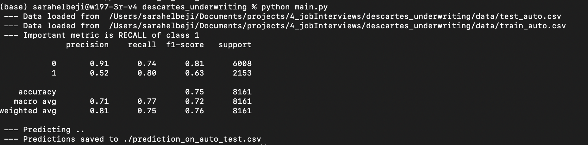

# data-scientist-technical-test

## Notebook : test_notebook.ipynb

The results of data analysis, modeling and training scores for all used models are under the jupyter notebook : test_notebook.ipynb.

The results for main.py are also included in the notebook.

## Code : main.py
Has final code that :
	- calls the best model
    - pre-process training and testing data
    - evaluate model on training data and returns a full classification report). Look for recall : the metric we were trying to maximize. (The rationales are explained in the notebook).
    - make predictions and save them into : prediction_on_auto_test.csv   

### running main.py
```
python ./main.py
```
### result on terminal


## Requirements
Requirements are written under requirements.txt

## Project tree

├── README.md
├── data
│   ├── MEAN_AUTO.csv
│   ├── SHELL_AUTO.csv
│   ├── test_auto.csv                      -> used data for training
│   └── train_auto.csv                     -> used data for predicting
├── main.py
├── models
│   ├── Preprocessor                       -> data pre-processor
│   ├── model_Boosting                     
│   ├── model_LR
│   ├── model_NB
│   ├── model_RF
│   └── model_SVC
├── prediction_on_auto_test.csv           -> results for predictions. stroed as .csv file with columns : INDEX, TARGET_FLAG.
├── requirements.txt                      -> required python packages for this project.
├── screen.png
└── test_notebook.ipynb                   -> notebook that contains all experiments and results.

